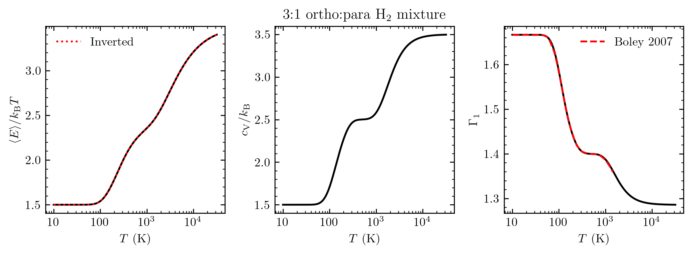

# molecular_eos
routines for computing the equation of state quantities of a partially-ionized mixture of molecular and atomic hydrogen and helium

The most nontrivial and potentially-useful routines are in parition_functions.py and partition_function.c, which implement methods to compute quantities from the partition function of H_2 accounting for all 3 degrees of freedom (translation, rotational, and vibration). Efficient summation of the rotational partition function is achieved without expensive function calls, using a recurrence relation between the terms.

